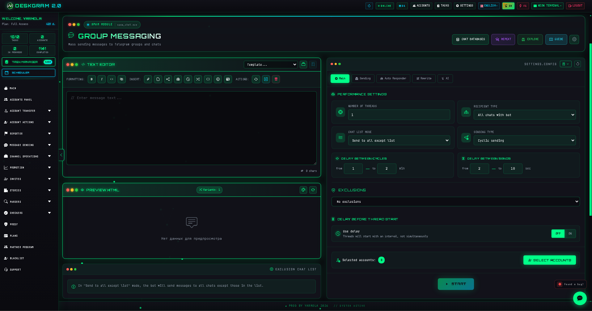
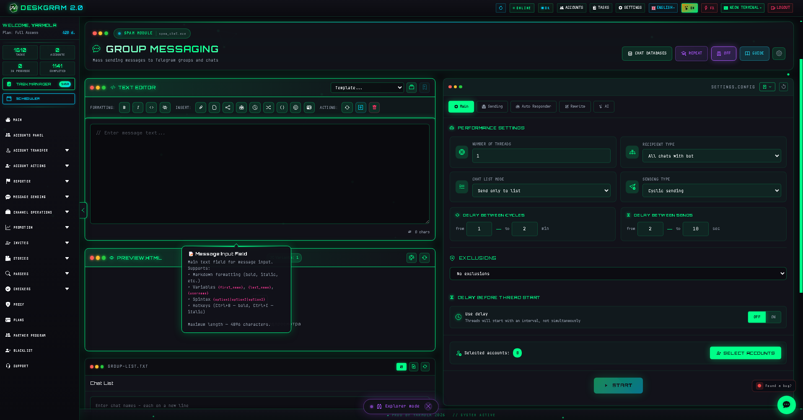
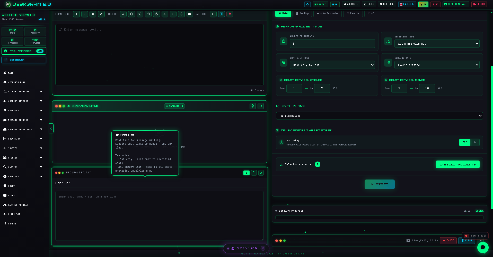
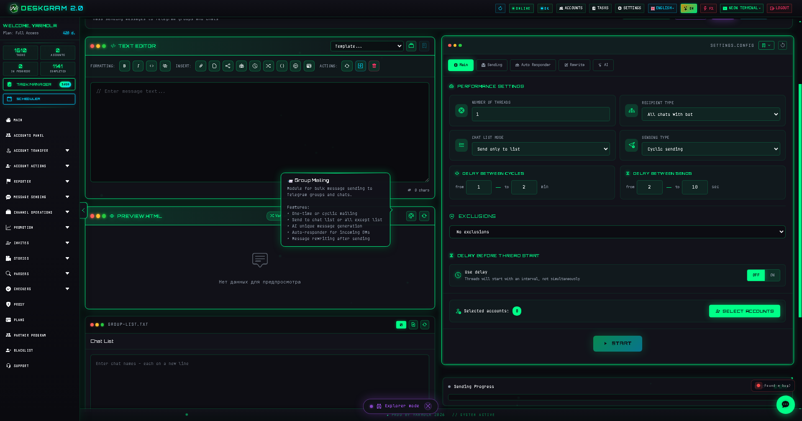

# Telegram Group Messaging with Deskgram 2

Telegram Group Messaging in Deskgram 2 helps send prepared messages into existing chats and groups, manage chat or exclusion lists, and keep sending, autoresponder, and AI settings inside one route.

[Deskgram 2 Hub](https://github.com/Deskgram-2/deskgram-2-telegram-automation-en) · [Website](https://deskgram2.com/) · [Telegram Bot](https://t.me/DG2welcomebot) · [Web Preview](https://deskgram2.com/web-preview?path=%2Fapp-demo%2F&lang=en)

## Interactive Web Preview

Try the module interface in the browser: [Open web preview](https://deskgram2.com/web-preview?path=%2Fapp-demo%2Ffunctions%2Fspam_chat&lang=en)

## Screenshots

## About the module

| Parameter | What is inside |
|---|---|
| Main task | Sending messages into existing Telegram chats and groups |
| Important blocks | Message constructor, chat lists, settings tabs, autoresponder, AI |
| Useful for | Community outreach, chat-based touchpoints, support or engagement routes |
| Related sections | Direct Messaging, Keyword Subscriptions, Chat Warmup, Task Manager |

## What it can do

- send prepared messages into existing chats and groups;
- switch between list-only and exclusion-list modes;
- control performance, delays, and sending logic;
- connect autoresponder and AI settings inside the same route;
- treat group discussions as a separate execution layer beside direct messages.

## Quick start

1. Build the message in the constructor.
2. Prepare the chat list or exclusion list.
3. Configure performance, delays, and sending logic.
4. Enable autoresponder or AI options when needed.
5. Launch the module and monitor logs and stats.

## Related repositories

- [Deskgram 2 Hub](https://github.com/Deskgram-2/deskgram-2-telegram-automation-en)
- [Direct Messaging](https://github.com/Deskgram-2/telegram-direct-messaging-deskgram-en)
- [Keyword Subscriptions](https://github.com/Deskgram-2/telegram-keyword-subscriptions-deskgram-en)
- [Chat Warmup](https://github.com/Deskgram-2/telegram-chat-warmup-deskgram-en)
- [Task Manager](https://github.com/Deskgram-2/telegram-task-manager-deskgram-en)

## FAQ

### Can I inspect the module before installing anything?

Yes. The web preview already shows the message constructor, chat list, and core settings tabs.

### Is this the same as direct messaging?

No. This route is focused on existing chats and group discussions rather than one-to-one outreach.
